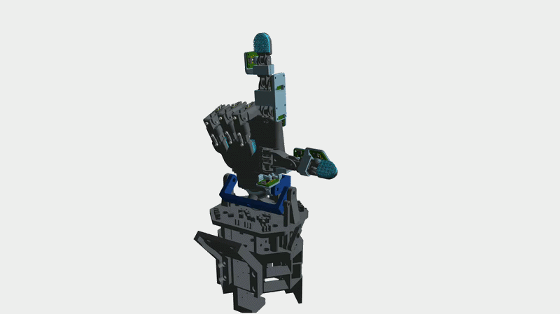
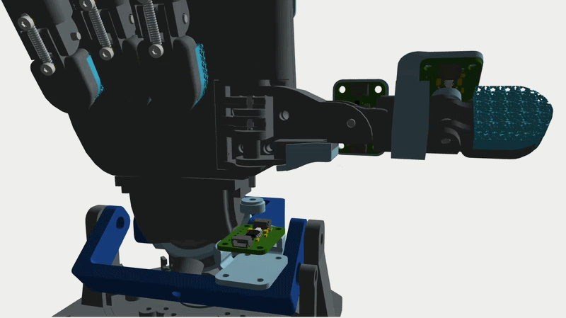
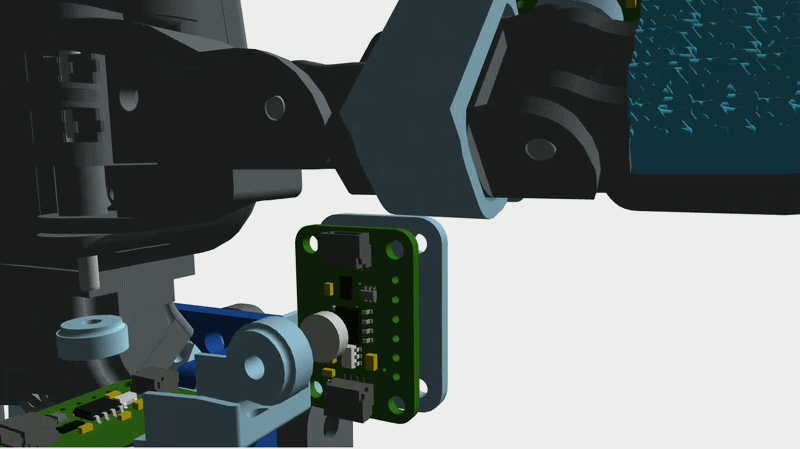
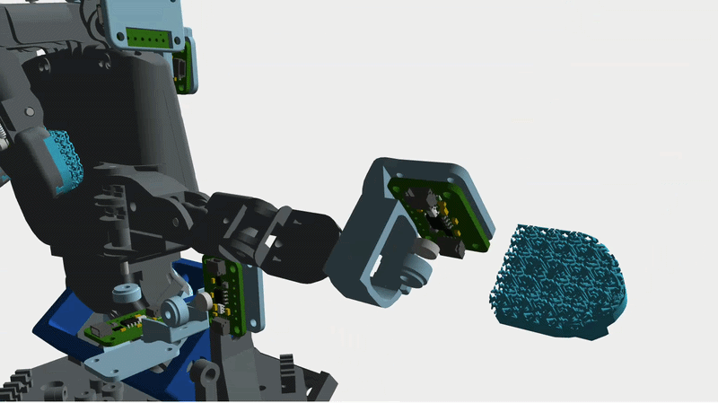
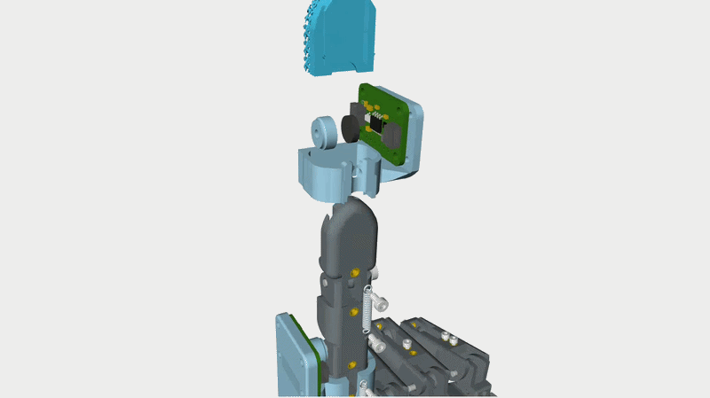
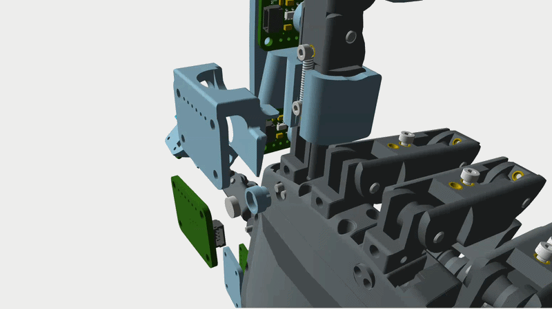

# Encoders Assembly

### Instructions

#### 1. Thumb Sensors (Wrist to Tip)

**Thumb CMC**
Slide the CMC holder up from the wrist area into its designated position.
Secure it using the two screws on the bottom of the wrist:
* **Inner Screw**: Tighten with a standard screwdriver.
* **Outer Screw**: Tighten with an Allen key.

**Thumb MCP**
Slide the MCP holder onto the joint assembly.
Fasten it securely by tightening the nut at the bottom of the holder.

**Thumb DIP**
Follow the same logic as the Index DIP: Slide the holder onto the joint, ensure the magnet is seated in its pin, and insert the 3D-printed securing part.
Reattach the tensioning springs and tighten the screws.

#### 2. Index Abduction Sensor

Ensure the magnet cap is placed inside the frame slot (or inside the holder).
Slide the abduction sensor holder into its slot near the base of the index finger.
Tighten the single securing screw visible from the top of the hand frame.

#### 3. Index Finger Sensors (MCP to DIP)

The index finger assembly requires careful alignment of pins and magnets:

1. **Relieve Frame Tension**: Temporarily loosen or remove the springs and pins if the frame is too tight to allow the holders to slide on.
2. **MCP Installation**:
Slide the MCP sensor holder onto the joint (this is a tight fit and may require force).
Position the magnet into the pin (use pliers if necessary to guide it until it snaps into place).

3. **DIP Installation**:
Slide the DIP sensor holder onto the tip joint.
Insert the small circular magnet holder onto the pin.
Slide the 3D-printed securing part in to lock the assembly.
4. **Finalize Index Frame**:
Ensure all pins are fully seated.
Tighten the outer-most screw on the MCP section.
Re-hook the DIP and PIP springs and tighten their securing screws to restore finger tension.

#### 4. Electronics Reintegration

* **Mount Multiplexer**: Place the red TCA9548A I2C multiplexer board back onto the rear of the hand.
* **Connect Qwiic Cables**: Plug the Qwiic cables from the multiplexer into each sensor according to the following mapping (based on the calibration JSON):

| Mux Port | Sensor Name | Joint Type |
| :---: | :--- | :--- |
| **0** | Index Abduction | Base |
| **1** | Index DIP | Tip |
| **2** | Index PIP | Middle |
| **3** | Index MCP | Knuckle |
| **4** | Thumb CMC | Base |
| **5** | Thumb MCP | Middle |
| **6** | Thumb DIP | Tip |

*Tip: Ensure the cables are routed cleanly to avoid interference with the joint movements.*
* **USB Connection**: Connect the USB-C cable from the ESP32/microcontroller to your host PC for testing.

#### 5. Verification

After assembly, run the following to verify sensor readings:
1. Open the `firmware/Microcontroller_AS5600.ino` in the Arduino IDE to check the Serial Monitor.
2. Run a calibration test to ensure all sensors are tracking correctly.
